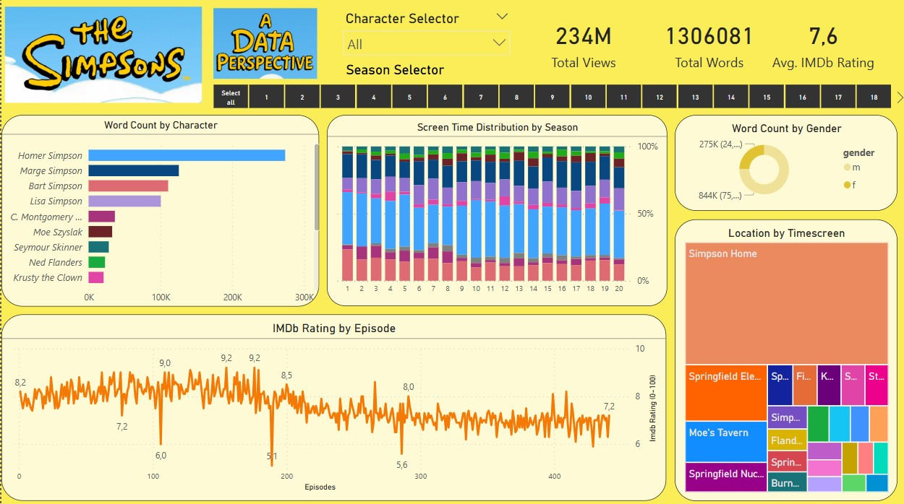

📊 The Simpsons: A Data Perspective

This project offers a comprehensive data analysis of The Simpsons using Power BI. It explores character dialogues, screen time distribution, gender dynamics, IMDb ratings, and scene locations across 20 seasons of the show.

📂 Project Overview
File: TheSimpsons_Analysis.pbix
Tool: Power BI
Dataset Source: Transcripts, episode metadata, and publicly available character information
Seasons Analyzed: 1–20
Total Episodes: 400+

📌 Key Insights Visualized

🗣️ Word Count by Character
A horizontal bar chart highlighting the top-speaking characters, with Homer Simpson dominating the dialogue by a large margin.

🧍‍♂️🧍‍♀️ Word Count by Gender
A donut chart showing the total number of words spoken by male and female characters, with a clear gender imbalance (approximately 75% male).

🎞️ Screen Time Distribution by Season
Stacked bar charts show how screen time is shared among key characters across seasons, reflecting narrative shifts over time.

📍 Location by Timescreen
A treemap breaking down the most common locations per screen time, with The Simpson Home as the most frequent, followed by Springfield Elementary, Moe’s Tavern, and Nuclear Plant.

⭐ IMDb Rating by Episode
A line chart tracking the IMDb rating of each episode, showing peak ratings in earlier seasons (e.g., 9.2) and a gradual decline over time.

📺 Total Stats

    Total Views: 234M

    Total Words Analyzed: 1,306,081

    Average IMDb Rating: 7.6

🧭 How to Use

    Open the .pbix file using Power BI Desktop.

    Interact with filters such as:

        Character Selector

        Season Selector

    Hover over visuals to explore detailed tooltips and trends.

💡 Goals

    Explore narrative and character evolution over 20 seasons.

    Detect trends in popularity and writing through IMDb ratings.

    Examine gender balance and location prominence in the series.
